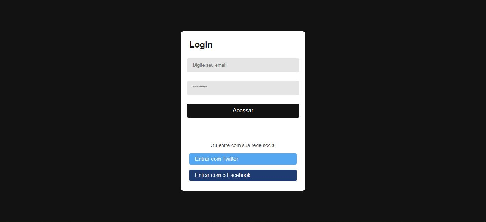

# Bem vindo! 👋

## - Página de Login com HTML e CSS

  

    

## 🚀 Tecnologias

Esse projeto foi desenvolvido com as seguintes tecnologias:

- HTML
- CSS

## 💻 Projeto

Recriando uma página de Login do desafio da DevMentor Brasil [Link do desafio](https://www.devmentor.com.br/desafios/pagina-login-com-html-e-css)

**Funcionalidades que o projeto deve ter:**

- Uma pagina de login com área e campos para digitar o e-mail e senha.
- Layout responsivo a diferentes tamanhos de telas.
- A pagina não é funcional, apenas possui uma pagina estática de login para praticar os conhecimentos com HTML, CSS, desafiando a desenvolver 
uma página de login conforme o layout a baixo.

## 🔖 Layout

Você pode visualizar o layout do projeto através [DESSE LINK](https://www.figma.com/file/XoLNQWRshF72dKMCFNyKA7/Pagina-Login?node-id=0%3A1)

## :memo: Licença

Esse projeto está sob a licença MIT.
